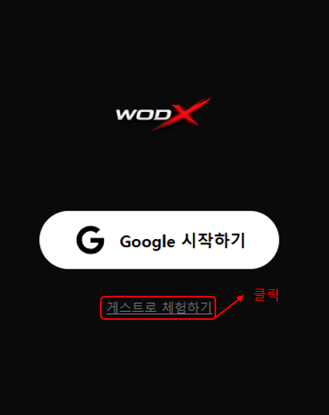

# WODX

> 크로스핏 박스를 위한 WOD 관리 & 기록 트래킹 웹앱

[](https://wodx-taupe.vercel.app/)
[](https://nextjs.org/)
[](https://firebase.google.com/)
[](https://tailwindcss.com/)

## 배포 URL

**[https://wodx-taupe.vercel.app/](https://wodx-taupe.vercel.app/)**

---

## 주요 기능 시연

# 시작에 앞서...



## 게스트 로그인을 진행하여 원활한 진행 요청드립니다.

### 시작 및 로그인 홈 및 와드 확인


---

### 오늘 와드 기록 등록 및 랭킹 확인

## 

### PR Board 관리 및 기록 등록 그래프 확인


### Profile 및 개인정보 수정, 로그아웃


## 프로젝트 소개

**WODX** 는 크로스핏 박스 회원들을 위한 WOD(Workout of the Day) 관리 및 운동 기록 트래킹 웹앱입니다.

관리자가 매일 WOD 를 등록하면 회원들은 자신의 기록을 입력하고, 리더보드와 레이더 차트를 통해 다른 회원들과 기록을 비교할 수 있습니다.

운동 능력을 Power, Strength, Skill, Endurance, Conditioning의 5가지 요소로 분류하고
레이더 차트를 활용해 사용자 운동 데이터를 시각화했습니다.
이를 통해 사용자는 자신의 운동 밸런스를 직관적으로 파악하고 부족한 영역을 데이터 기반으로 개선할 수 있습니다.

---

## 앱 화면 흐름 (Flowchart)

```
┌─────────────────────────────────────────────────────────────┐
│                      01. 시작 화면                           │
│         배경:  WODX 로고 + [START] 버튼                       │
└─────────────────────────┬───────────────────────────────────┘
                          │ START 버튼 클릭
                          ▼
┌─────────────────────────────────────────────────────────────┐
│                      02. 로그인 화면                          │
│              WODX 로고 + [Google 시작하기] 버튼               │
│              (Google OAuth 소셜 로그인)                       │
└─────────────────────────┬───────────────────────────────────┘
                          │ 로그인 성공
                          ▼
┌─────────────────────────────────────────────────────────────┐
│                    03. 홈 (Home)                             │
│  - 날짜 표시 (예: 3월 23일 월요일)                            │
│  - TODAY'S WOD 카드                                          │
│    · WOD 제목 (예: 260323 "Rowing, Burpee jump over bar...") │
│    · 세션 A / B 구분                                         │
│    · 운동 타입 뱃지 (EVERY, AMRAP 등)                         │
│    · 사용 무게 표시 (예: 135lb / 85lb)                        │
└──────────┬──────────────┬──────────────────────────────────-┘
           │              │
           │ 스크롤 다운   │ 하단 탭 이동
           ▼              ▼
┌──────────────────┐    ┌─────┬──────┬──────────┬─────────┐
│  04. 댓글 영역    │    │Home │ WOD  │  Record  │PR Board │ Profile │
│  - DONE 체크     │    └─────┴──────┴──────────┴─────────┘
│  - COMMENTS 목록  │
│  - 좋아요 / 삭제  │
│  - 댓글 입력 + 등록│
└──────────────────┘
```

## 전체 화면 스크린샷


## 주요 기능

### 회원관리

- **Google OAuth 로그인** - 간편한 소셜 로그인
- **WOD 확인** - 날짜별 오늘의 운동 확인 및 댓글
- **기록 등록** - WOD 타입별 (For Time / AMRAP / EMOM / Every / Strength) 기록 입력
- **리더보드** - 남/여 분리, 레벨별 순위 확인
- **출석 달력** - 월간 출석 현황 시각화
- **PR Board** - 개인 최고 기록 관리 (Power / Strength / Skill / Endurance / Conditioning)
- **레이더 차트** - 5가지 운동 능력치 시각화
- **실시간 알림** - WOD 등록 알림, 댓글 좋아요leaderboard알림

### 관리자

- **WOD 등록/수정/삭제** - 파트별 타입, 무게, 팀 여부 설정
- **WOD 등록 시 전체 알림 발송**

---

## 기술 스택

### Frontend

| 기술         | 설명                             |
| ------------ | -------------------------------- |
| Next.js 14   | App Router 기반 React 프레임워크 |
| TypeScript   | 정적 타입 언어                   |
| Tailwind CSS | 유틸리티 기반 스타일링           |
| Recharts     | 라인 차트 / 레이더 차트          |
| Font Awesome | 아이콘 라이브러리                |
| date-fns     | 날짜 처리 라이브러리             |

### Backend & 인프라

| 기술            | 설명                      |
| --------------- | ------------------------- |
| Firebase Auth   | Google OAuth 인증         |
| Cloud Firestore | NoSQL 실시간 데이터베이스 |
| Vercel          | 배포 플랫폼               |

---

## 시스템 아키텍처

### 전체 구조

```
사용자 (Browser)
    ↓
Next.js 14 (App Router)
  ├── Server Component  → 초기 데이터 SSR
  └── Client Component → 상태관리 / 이벤트 처리
    ↓
Firebase
  ├── Firebase Auth    → 인증 (Google OAuth / 익명)
  ├── Cloud Firestore  → NoSQL 실시간 DB
  └── Firebase Storage → 이미지 저장(미구현-테스트 진행중)
    ↓
Vercel (배포 / CI-CD)
  └── GitHub 연동 → push 시 자동 빌드 & 배포
```

---

### Firestore 컬렉션 구조

```
gyms/                        # 체육관
  └── {gymId}/
        ├── name
        ├── code
        └── imageUrl

gymMembers/                  # 체육관 멤버십
  └── {memberId}/
        ├── gymId
        ├── userId
        └── role             # admin / member

users/                       # 유저
  └── {userId}/
        ├── name
        ├── role             # master / admin / user
        └── currentGymId

wods/                        # 오늘의 운동
  └── {wodId}/
        ├── gymId
        ├── title
        ├── date
        └── parts[]
              ├── type       # For Time / AMRAP / EMOM / Every / Strength
              ├── weights[]
              └── isTeam

workoutRecords/              # 운동 기록
  └── {recordId}/
        ├── gymId
        ├── userId
        ├── wodId
        ├── level            # Rxd / Scale / Beginner
        ├── finishTime
        └── weights[]

notifications/               # 알림
  └── {notificationId}/
        ├── gymId
        ├── userId
        └── type

prRecords/                   # PR 기록
  └── {prId}/
        ├── userId
        └── category         # Power / Strength / Skill / Endurance / Conditioning
```

---

### Role 기반 권한 구조

```
master
  ├── 전체 체육관 관리
  ├── Solo Athlete WOD 등록
  └── 모든 admin 권한 포함

admin
  ├── 소속 체육관 WOD 등록 / 수정 / 삭제
  ├── 멤버 관리 (강퇴 / 역할 변경)
  └── WOD 등록 시 전체 알림 발송

user
  ├── WOD 조회 및 기록 등록
  ├── 리더보드 확인
  └── PR Board 관리

guest (익명 인증)
  ├── WOD 조회 및 기록 등록
  └── 체육관 가입 불가
```

---

### 커스텀 훅 구조

```
hooks/
  ├── auth/
  │     ├── useAuthGuard       # 로그인 여부 체크 → 미로그인 시 /login
  │     ├── useAdminGuard      # admin/master 체크 → 권한 없으면 /home
  │     ├── useMasterGuard     # master 전용 체크
  │     └── useInAppBrowser    # 카카오 등 인앱브라우저 감지
  │
  ├── wod/
  │     ├── useTodayWod        # 오늘 WOD 조회
  │     └── useWodByDate       # 날짜별 WOD 조회
  │
  ├── record/
  │     ├── useMyRecords       # 내 기록 조회
  │     ├── useLeaderboard     # 리더보드 조회
  │     └── useRecordForm      # 기록 등록/수정 폼 상태관리
  │
  └── user/
        ├── useUserInfo        # 유저 정보 조회
        ├── useGymManager      # 체육관 가입/생성/전환/탈퇴/멤버관리
        └── useCalendar        # 출석 캘린더
```

---

### 멀티 체육관 (gymId 기반) 아키텍처

```
기존 구조 (단일 체육관)
  모든 데이터 → 단일 컬렉션으로 관리

개선된 구조 (gymId 기반 멀티 체육관)
  모든 쿼리에 gymId 필터 적용
    ├── getTodayWod(gymId)
    ├── getMyRecords(userId, gymId)
    ├── getLeaderboard(date, gymId)
    └── getGymUsers(gymId)

  체육관별 독립적인 데이터 관리
    ├── WOD
    ├── 기록
    ├── 리더보드
    └── 멤버

  PUBLIC_GYM_ID = "public"
    └── Solo Athlete → 체육관 없는 유저 기본 배정
```

---

## 폴더 구조

```
src/
├── app/
│   ├── page.tsx                    # 스플래시
│   ├── login/                      # 로그인
│   ├── onboarding/profile/         # 최초 프로필 설정
│   ├── home/                       # 홈
│   ├── wod/                        # WOD 페이지
│   ├── record/                     # 기록 (등록/수정/목록)
│   ├── prdata/                     # PR Board
│   ├── profile/                    # 프로필
│   └── admin/wod/                  # 관리자 WOD 관리
│
├── components/ui/
│   ├── BottomNav.tsx               # 하단 네비게이션
│   ├── HomeHeader.tsx              # 상단 헤더
│   ├── WodCard.tsx                 # WOD 카드
│   ├── AttendanceCalendar.tsx      # 출석 달력
│   └── AthleteRadar.tsx            # 레이더 차트
│
├── hooks/
│   ├── auth/                       # 인증 관련 훅
│   ├── wod/                        # WOD 관련 훅
│   ├── record/                     # 기록 관련 훅
│   ├── user/                       # 유저 관련 훅
│   └── social/                     # 댓글 관련 훅
│
├── lib/
│   ├── firebase.ts                 # Firebase 초기화
│   ├── firestore.ts                # Firestore CRUD
│   ├── auth.ts                     # 인증 함수
│   ├── utils.ts                    # 유틸 함수
│   └── constants.ts                # 상수
│
└── types/
    └── wod.ts                      # 타입 정의
```

---

## 시작하기

### 요구사항

- Node.js 18 이상
- Firebase 프로젝트

### 설치

```bash
# 저장소 클론
git clone https://github.com/LionSeopBong/project-01.git

# 패키지 설치
cd wodx
npm install
```

### 환경 변수 설정

`.env.local` 파일을 생성하고 Firebase 설정값을 입력.

```env
NEXT_PUBLIC_FIREBASE_API_KEY="your_api_key_here"
NEXT_PUBLIC_FIREBASE_AUTH_DOMAIN="your_auth_domain_here"
NEXT_PUBLIC_FIREBASE_PROJECT_ID="your_project_id_here"
NEXT_PUBLIC_FIREBASE_STORAGE_BUCKET="your_storage_bucket_here"
NEXT_PUBLIC_FIREBASE_MESSAGING_SENDER_ID="your_messaging_sender_id_here"
NEXT_PUBLIC_FIREBASE_APP_ID="your_app_id_here"
NEXT_PUBLIC_FIREBASE_MEASUREMENT_ID="your_measurement_id_here"
```

### 실행

```bash
# 개발 서버 실행
npm run dev

# 프로덕션 빌드
npm run build
```

---

## 기술적 고민과 해결

### 1. 파트별 기록 독립 관리

WOD 에 A/B 파트가 있을 때 파트를 전환하면 기존 입력값이 초기화되는 문제가 있었습니다.
`Record<string, Partial<WorkoutRecord>>` 형태로 파트별 state 를 독립적으로 관리하여 해결했습니다.

### 2. 실시간 알림

`getDocs` 로 알림을 불러오면 `serverTimestamp()` 값이 `null` 로 읽히는 문제가 있었습니다.
Firestore 의 `onSnapshot` 으로 실시간 구독 방식으로 변경하여 해결했습니다.

### 3. 레이더 차트 정규화

Power, Strength, Skill, Endurance, Conditioning 5가지 카테고리의 단위가 모두 달라 (kg, reps, 초) 동일한 차트에 표현하기 어려웠습니다.
성별별 목표값 (maleMax / femaleMax) 과 운동별 가중치를 적용하여 0~100점으로 정규화했습니다.

### 4. Hydration 오류

날짜를 서버/클라이언트에서 다르게 렌더링하여 Hydration 오류가 발생했습니다.
`useEffect` 와 `suppressHydrationWarning` 을 적용하여 해결했습니다.

---

## 추후 방향

### 1. 멀티 체육관 지원 확장 (26.04.10 진행완료)

GymId 구조를 도입하여 체육관별로 WOD, 회원, 기록을 독립적으로 관리할 수 있도록 확장할 예정입니다.
이를 통해 여러 크로스핏 박스가 하나의 플랫폼에서 운영될 수 있는 SaaS 구조로 발전시키는 것이 목표입니다.

### 2. 소속 체육관의 그룹 수업 예약 기능 (26.04.12 ~ 구현 진행중)

체육관의 클래스 수업을 시간대별로 등록하고 회원이 실시간으로 예약할 수 있는 기능을 추가할 예정입니다.
정원 관리와 출석 체크를 자동화하여 체육관 운영 효율성을 높이는 기능을 구현하고자 합니다.

### 3. 체육관 대항전 및 소속 체육관별 랭킹 기능

동일한 WOD를 기반으로 체육관 간 기록을 비교하여 체육관 대항전 이벤트 및 랭킹 시스템을 구현할 예정입니다.
이를 통해 커뮤니티 활성화와 참여도를 높이는 서비스 기능을 추가하고자 합니다.

### 4. 결제 연동

회원권 결제, 남은 기간, 홀딩, 연장 등을 관리할 수 있는 결제 시스템을 연동할 예정입니다.
Stripe 또는 PG사(토스페이먼츠 등)를 활용하여 회원권 결제 및 구독 기능을 구현하고, 체육관 운영에 필요한 통합 회원 관리 시스템으로 확장하는 것이 목표입니다.

## 개발자

| 항목   | 내용                                                       |
| ------ | ---------------------------------------------------------- |
| 이름   | 박한섭                                                     |
| GitHub | [github.com/LionSeopbong](https://github.com/LionSeopbong) |
| 연락처 | 010-7641-0376                                              |

---
