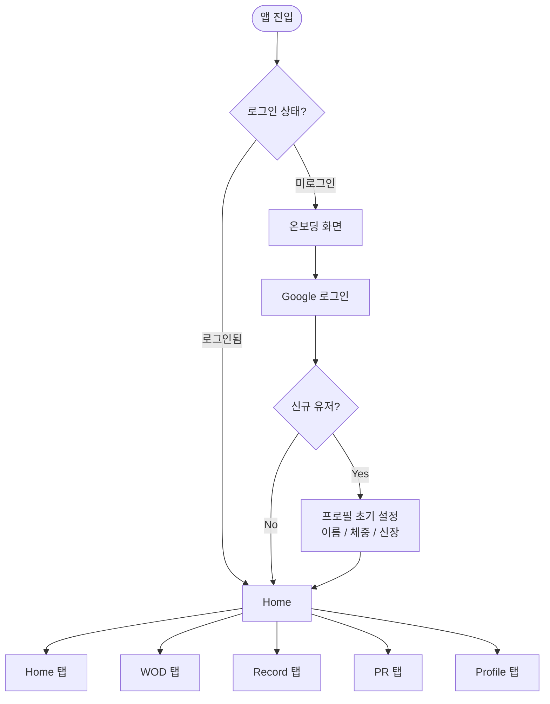
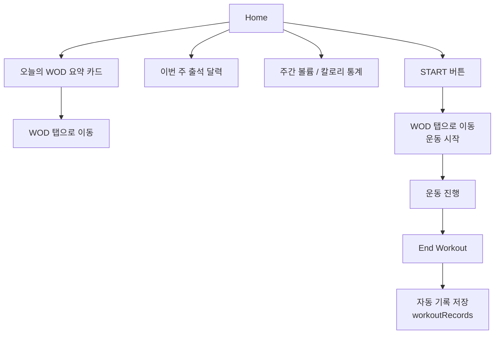
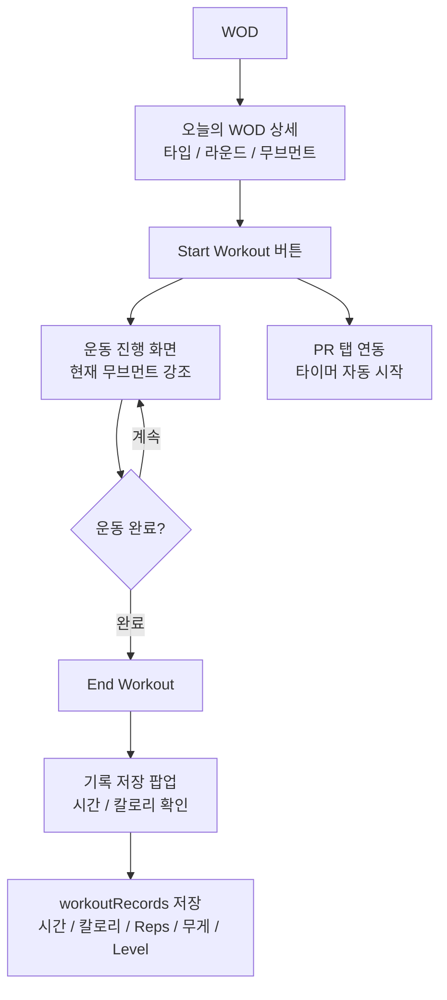
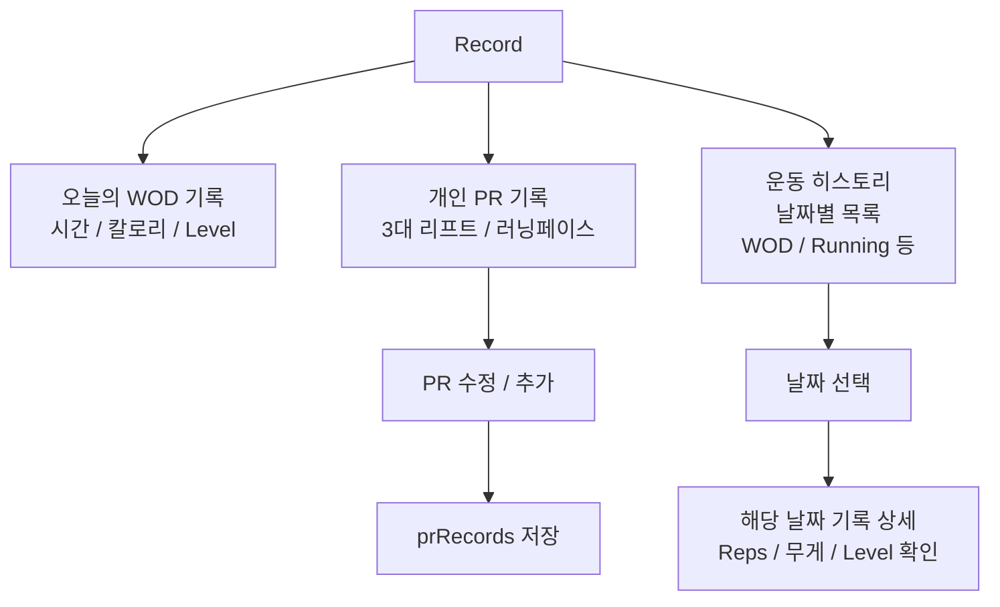
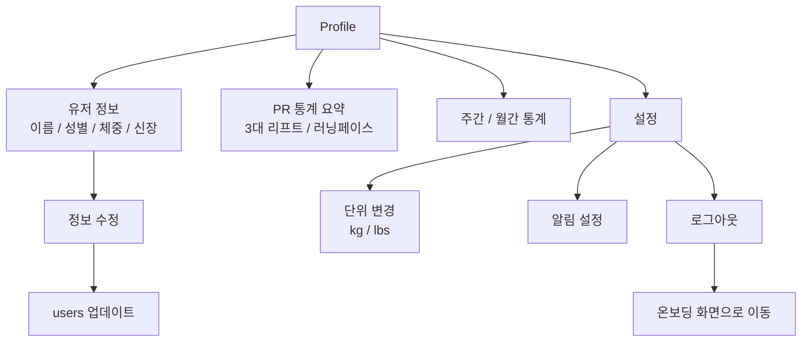
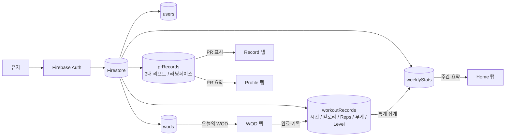

# WODX 화면 흐름도

> 전체 페이지 흐름 — 로그인부터 각 탭까지

---

## 전체 흐름 개요

---

## 🏠 Home 탭 흐름

---

## 💪 WOD 탭 흐름

---

## 📊 Record 탭 흐름

---

---

## 👤 Profile 탭 흐름

---

## 🔄 데이터 흐름 요약

---

_WODX — Build The Athlete_ 🔥
